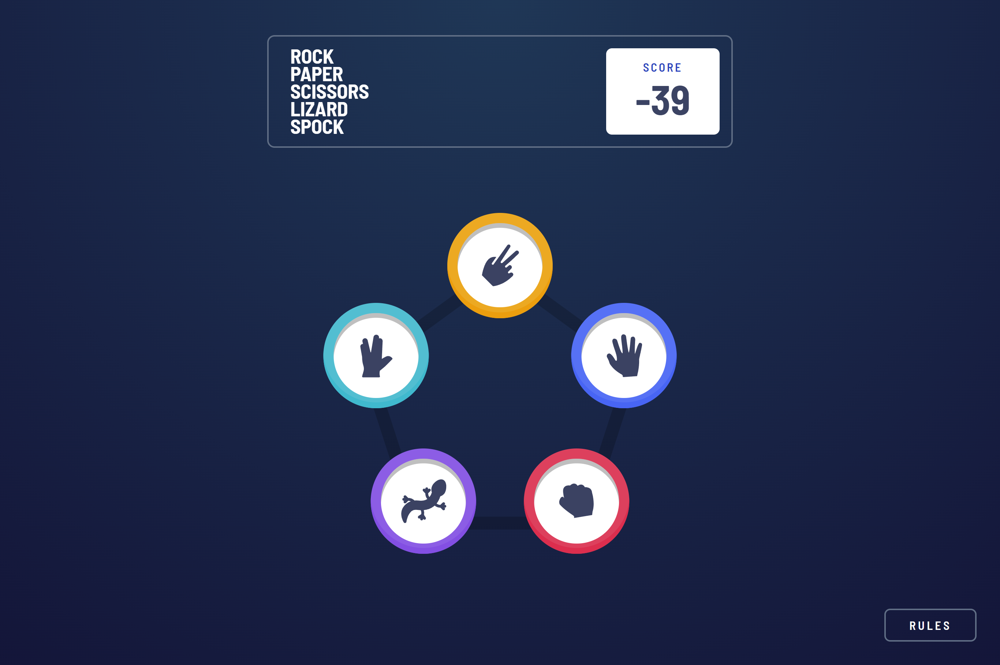
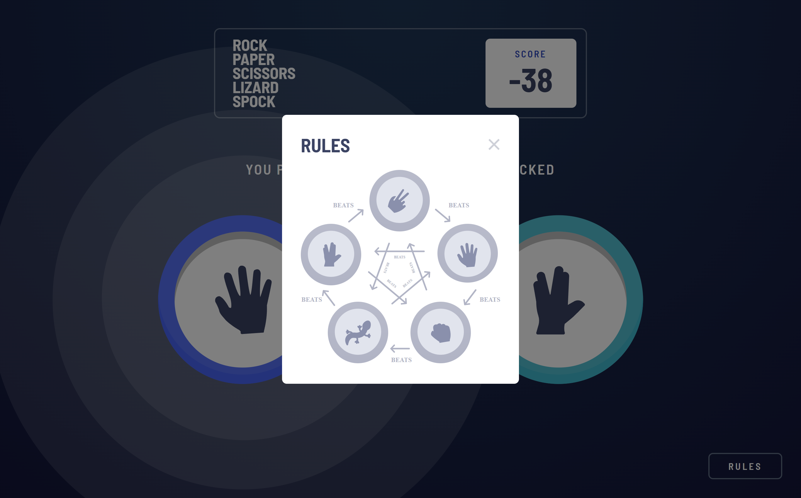
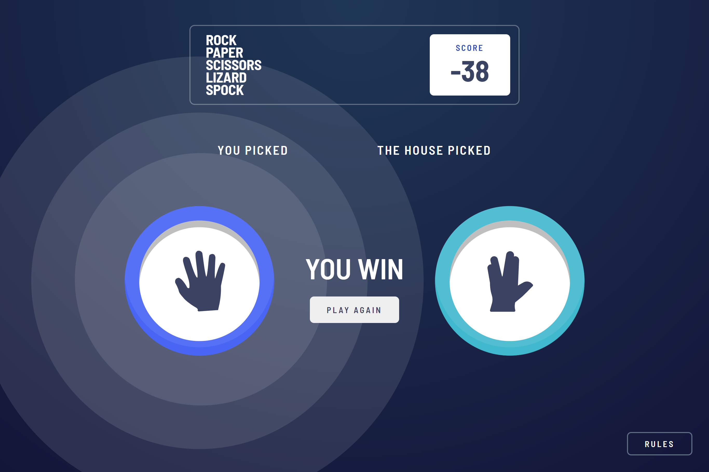
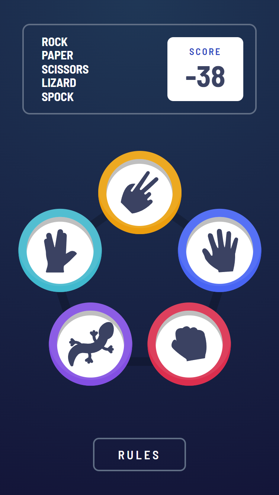
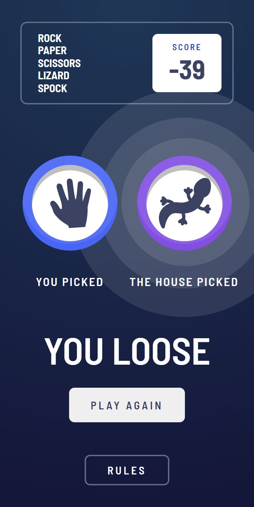
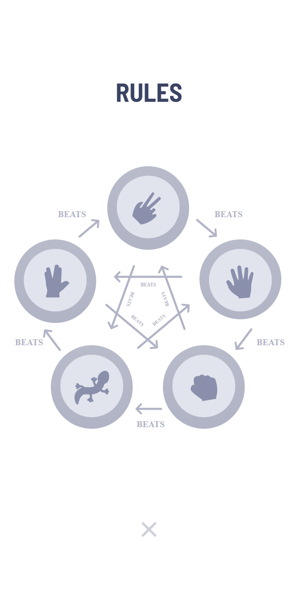

# Frontend Mentor - Rock, Paper, Scissors solution

This is a solution to the [Rock, Paper, Scissors challenge on Frontend Mentor](https://www.frontendmentor.io/challenges/rock-paper-scissors-game-pTgwgvgH). Frontend Mentor challenges help you improve your coding skills by building realistic projects. 

## Table of contents

- [Overview](#overview)
  - [The challenge](#the-challenge)
  - [Screenshot](#screenshot)
  - [Links](#links)
- [My process](#my-process)
  - [Built with](#built-with)
  - [What I learned](#what-i-learned)
  - [Continued development](#continued-development)
  - [Useful resources](#useful-resources)
- [Author](#author)
- [Acknowledgments](#acknowledgments)


## Overview

### The challenge

Users should be able to:

- View the optimal layout for the game depending on their device's screen size
- Play Rock, Paper, Scissors against the computer
- Maintain the state of the score after refreshing the browser _(optional)_
- **Bonus**: Play Rock, Paper, Scissors, Lizard, Spock against the computer _(optional)_

### Screenshot


Here are my results: 














### Links

- Solution URL: [Github source](https://github.com/LucasNahuel/react-rock-paper-scissor)
- Live Site URL: [rock-paper-scissors on vercel](https://react-rock-paper-scissor-pied.vercel.app/)

## My process

### Built with

- HTML5
- CSS custom properties:
  - Flexbox
  - Media Queries
  - CSS animations
- [React](https://reactjs.org/) - JS library

### What I learned

This was my first time adding animations to a react project. I've learned better ways to synchronize css animations with dynamics components styles changes and react states.

Also, this was my first time using the gradient CSS property, needed to match the design:

```css
.body {
  background-image: radial-gradient(circle at 50% 0%, var(--radial-gradient-start), var(--radial-gradient-end));
}
```


### Continued development

Not all changes over layout is animated, but was enough to me for learning. Fully animate the interface would be a nice touch.


### Useful resources

- [CSS radial gradient property](https://www.w3schools.com/css/css3_gradients_radial.asp) - This helped me to learn to mix colours in a gradual, radial way needed to match the design background.

## Author

- Website - [Munoz Lucas Portfolio](https://angular-portfolio-lake.vercel.app/)
- Frontend Mentor - [@LucasNahuel](https://www.frontendmentor.io/profile/LucasNahuel)
- LinkedIn - [@Luki](https://www.linkedin.com/in/luki/)


## Acknowledgments

Thanks to the StackOverflow user [@Kolypto](https://stackoverflow.com/users/134904/kolypto) for his answer on this [thread](https://stackoverflow.com/questions/12813573/position-icons-into-circle#:~:text=There%20is%20no%20way%20to,left%20to%20target%20it's%20place.) which inspired me to achieve the layout needed for the game.

